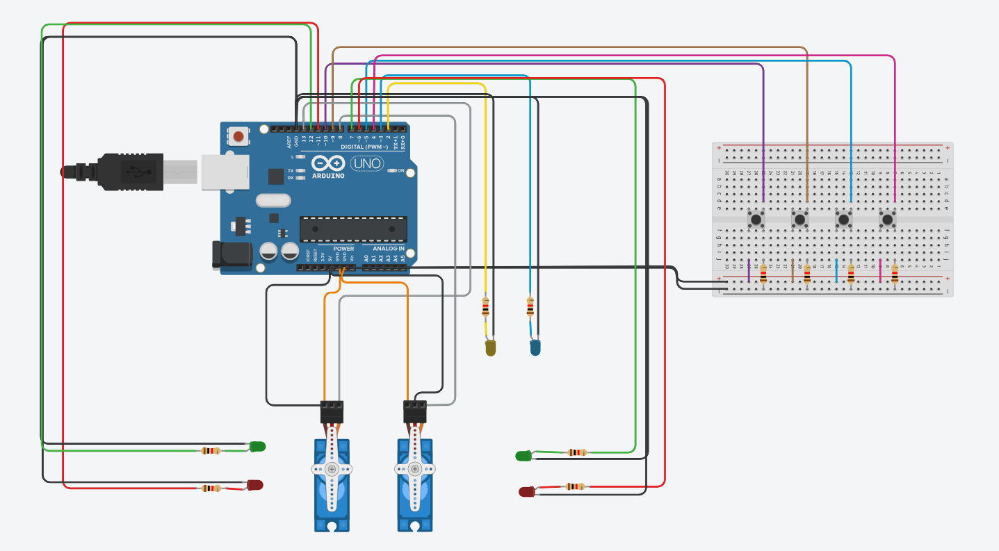
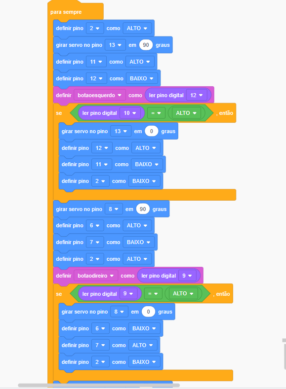

Inicialmente é montado uma estrutura com 1 arduino, 1 placa de ensaio, 2 servo motores, 4 botões, 6 leds e 6 resistores.
Em seguida, foram criadas as variáveis ("botaoesquerdo", "botoadireito", "botaofechar", "botaodoislados"), após isso, as variaveís foram definidas nos pinos.
Após a estruturação da sequência,  os leds vermelhos acendem para sinalizar que os portões estão fechados. Quando o primeiro botão é acionado, o servo motor da esquerda se abre e a luz verde acende, quando o segundo botão é acionado, o servo motor da direita se abre e a luz verde se acende. Quando o terceiro botão é acionado, os dois servo motores ficam fechados e as luzes vermelhas ficam acessas, sinalizando que o portão está fechado. Quando o quarto botão é acionado, os dois servo motores se abrem, a luz azul é acessa para indicar que o portão está totalmente aberto. Durante todas as movimentações, o led amarelo ficará ligado, indicando atenção. 

